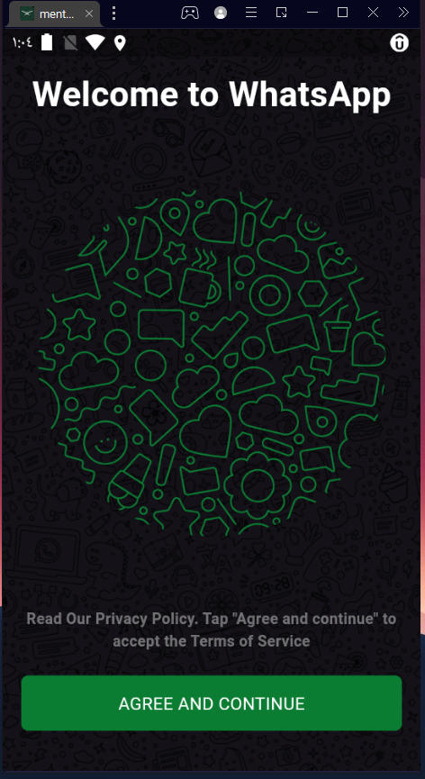

# mentorwhatsapp

## Chat App  

The **Chat App** is a Flutter-based chat application that features an elegant design, smooth animations, and robust functionality. With support for both light and dark modes, it ensures a seamless user experience tailored to different preferences.  

This app demonstrates key features such as user authentication, real-time chat, and a beautiful UI, highlighting the power of Flutter in building modern, feature-rich mobile applications.  

---

## Chat App Mockup  

### Features  

1. **ٍSplash Screens**  
  

2. **Authentication Screens**  

3. **Home  Feature**  

## Packages Used in the Project  

Below is the list of packages used with their correct links:  

- [equatable](https://pub.dev/packages/equatable): State management solution for predictable app state.  
- [bloc](https://pub.dev/packages/bloc): For selecting images from the device gallery or camera.  
- [firebase_core](https://pub.dev/packages/firebase_core): Core Firebase library for initializing Firebase in the app.  
- [firebase_auth](https://pub.dev/packages/firebase_auth): Authentication library for Firebase.  
- [shared_preferences](https://pub.dev/packages/shared_preferences): For storing key-value pairs locally on the device.  
- [cloud_firestore](https://pub.dev/packages/cloud_firestore): Firestore database integration for real-time data storage and retrieval.  
- [uuid](https://pub.dev/packages/uuid): Generate unique IDs.  
- [firebase_storage](https://pub.dev/packages/firebase_storage): Firebase library for uploading and retrieving files from storage.  
- [emoji_picker_flutter](https://pub.dev/packages/emoji_picker_flutter): For selecting emojis within the chat.  
- [connectivity_plus](https://pub.dev/packages/connectivity_plus): For detecting network connectivity status.  
- [flutter_launcher_icons](https://pub.dev/packages/flutter_launcher_icons): Simplifies customizing the app launcher icon.  
- [firebase_messaging](https://pub.dev/packages/firebase_messaging): Firebase library for handling push notifications.  
- [flutter_local_notifications](https://pub.dev/packages/flutter_local_notifications): For displaying local notifications in the app.  
- [googleapis_auth](https://pub.dev/packages/googleapis_auth): Authentication library for   
- [dio](https://pub.dev/packages/dio): A powerful HTTP client for making API requests.  

---

## Project Highlights  

- **State Management**: Utilizing `bloc` and `Cubit` for predictable and efficient state management.  
- **Clean Code**: Best practices are followed to ensure the app is maintainable and scalable.  
- **MVVM Architecture**: The codebase is structured into Model, View, and ViewModel layers for better organization and future scalability.  

---

